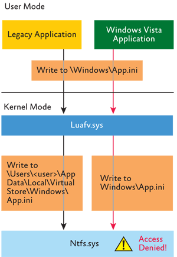

# UAC Virtualization

Windows Vista/7 introduced User Account Control (UAC) virtualization to improve application security for standard (i.e., non-admin) user accounts. It allows legacy applications to run by fooling them into thinking they have admin rights when they don't really need them.

The three main artifacts of UAC Virtualization are the paths associated with (i) file system and (ii) Registry namespace virtualization and (iii) application-compatibility shims. According to [Mark Russinovich,](https://technet.microsoft.com/en-us/library/2007.06.uac.aspx)

> When an application modifies a system-global location in the file system or registry and that operation fails because access is denied, Windows redirects the operation to a per-user area; when the application reads from a system-global location, Windows first checks for data in the per-user area and, if none is present, permits the read attempt from the global location.

You can see which applications are virtualized in **Task Manager** by showing the "Virtualization" column in the "Processes" tab (Vista/7) or by going to the "Details" tab and showing the "UAC virtualization" column (10). In **Explorer on Vista/7**, when you navigate to a folder that contains virtualized files, you will see a button appear named "Compatibility Files" and clicking this will take you to the corresponding `VirtualStore` directory (this button was removed in Windows 8).

## What Qualifies as a Legacy Application?

The three criteria that Windows uses to classify an application as legacy (and thus it is automatically virtualized) are that the program

1. is 32-bit,
2. is not running with administrative privileges, *and*
3. does not have [a manifest file](https://blogs.msdn.microsoft.com/patricka/2009/12/09/answers-to-several-application-manifest-mysteries-and-questions/) indicating it was written targeting Vista+.

## File System Namespace Virtualization

File system virtualization causes applications to create folders/files at the following user-specific path as if it were the root of `C:\`:

    %LocalAppData%\VirtualStore\

As an example, if `SomeLegacyApp.exe` wanted to create a file at `C:\Windows\SomeLegacyAppConfig.ini`, UAC virtualization will redirect the file to `C:\Users\doday\AppData\Local\VirtualStore\Windows\SomeLegacyAppConfig.ini`.

I think of it as a sort of "jail" path or sandbox wherein the program is tricked into thinking that it is the root of C:\ (or subfolders such as `Program Files`) and thus it can write to whatever path it wishes (without realizing it's actually in the VirtualStore path relative to that user). According to [Mark Russinovich,](https://technet.microsoft.com/en-us/library/2007.06.uac.aspx)

> The file system locations that are virtualized for legacy processes are `%ProgramFiles%`, `%ProgramData%`, and `%SystemRoot%`, excluding some specific subdirectories. However, any file with an executable extension, including `.exe`, `.bat`, `.scr`, `.vbs`, and others, is excluded from virtualization. This means that programs that update themselves from a standard user account fail instead of creating private versions of their executables that aren’t visible to an administrator running a global updater. To add additional extensions to the exception list, enter them in the following registry key and reboot:

    HKEY_LOCAL_MACHINE\System\CurrentControlSet\Services\Luafv\Parameters\ExcludedExtensionsAdd

This redirection is controlled by the "UAC File Virtualization Filter Driver" located at `%SystemRoot%\System32\Drivers\Luafv.sys`. Mark Russinovich has a helpful picture of how this this file system filter driver works in [his TechNet article on this topic](https://technet.microsoft.com/en-us/library/2007.06.uac.aspx):

## Registry Namespace Virtualization

You should generally only see this with legacy programs. According to [Microsoft,](https://msdn.microsoft.com/en-us/library/aa965884(VS.85).aspx)

> *Registry virtualization* is an application compatibility technology that enables registry write operations that have global impact to be redirected to per-user locations. This redirection is transparent to applications reading from or writing to the registry. It is supported starting with Windows Vista.
>
> This form of virtualization is an interim application compatibility technology; Microsoft intends to remove it from future versions of the Windows operating system as more applications are made compatible with Windows Vista and later versions of Windows. Therefore, it is important that your application does not become dependent on the behavior of registry virtualization in the system....
>
> If the caller reads from a key that is virtualized, the registry presents a merged view of both the virtualized values (from the virtual store) and the non-virtual values (from the global store) to the caller.

These Registry writes are redirected relative to the following path in the Registry:

    HKEY_USERS\<User SID>_Classes\VirtualStore\

Also known as:

    HKEY_ CURRENT_USER\Software\Classes\VirtualStore

This key is stored in `UsrClass.dat`.

Registry virtualization is *only* **enabled** for the following:

1. 32-bit interactive processes
2. Keys in `HKEY_LOCAL_MACHINE\Software` (with the exception of the subkeys listed below)
3. Keys an administrator can write to (if an admin can't write to the key, it would have failed even in older versions of Windows anyways)

It is **disabled** for processes that are:

 - 64-bit
 - non-interactice (e.g., services)
 - impersonating a user
 - kernel-mode (e.g., drivers)
 - equipped with an embedded manifest file that has `requestedExecutionLevel` specified
 - referencing any of the following keys/subkeys (these keys/subkeys are *not* virtualized):
   - `HKEY_LOCAL_MACHINE\Software\Classes`
   - `HKEY_LOCAL_MACHINE\Software\Microsoft\Windows`
   - `HKEY_LOCAL_MACHINE\Software\Microsoft\Windows NT`
   - any key explictly marked with a `REG_KEY_DONT_SILENT_FAIL` or `REG_KEY_DONT_VIRTUALIZE` flag

Registry virtualization is controlled by the Configuration Manager in the system kernel (`Ntoskrnl.exe`).

## Application Compatibility Shims

**NOTE:** I won't spend much time on this section because this has been covered *ad nauseam* by others in the DFIR community (whereas I've observed very little talk in the community about file system and Registry namespace virtualization).

Sometimes virtualizing the file system and/or Registry isn't enough to make a legacy application compatible with Vista+. as a result, Microsoft created the Application Compatibility Interface/Toolkit/Engine whereby the Application Compatibility Database (`C:\Windows\AppPatch\sysmain.sdb`) contains how an application or DLL should be "shimmed" with missing components during startup/load time. This can be as simple as lying about the OS version or as complex as providing an alternative function being called from a DLL (perhaps because its functionality and/or signature has changed or it has been deprecated). According to [Tim Newton,](https://blogs.technet.microsoft.com/askperf/2011/06/17/demystifying-shims-or-using-the-app-compat-toolkit-to-make-your-old-stuff-work-with-your-new-stuff/)

> The Shim Infrastructure implements a form of Application Programming Interface (API) hooking. The Windows API is implemented using a collection of DLLs. Each application built for Windows imports these DLLs, and maintains a table of the address of each of these functions in memory. Because the address of the Windows functionality is sitting in a table, it is straightforward for the shim engine to replace this address with the address of the shim DLL instead. The application is generally unaware that the request is going to a shim DLL instead of to Windows itself, and Windows is unaware that the request is coming from a source other than the application (because the shim DLL is just another DLL inside the application’s process).

Malware has been known to use this to hot-patch/inject programs/DLLs and escalate privileges (e.g., [IAT hooking](http://sandsprite.com/CodeStuff/IAT_Hooking.html)).

## Sources / Recommended Resources

 - Mark Russinovich, ["Inside Windows Vista User Account Control"](https://technet.microsoft.com/en-us/library/2007.06.uac.aspx), *Microsoft TechNet Magazine*, June 2007

 - MSDN, ["Registry Virtualization](https://msdn.microsoft.com/en-us/library/aa965884(VS.85).aspx)

 - Tim Newton, ["Demystifying Shims – or – Using the App Compat Toolkit to make your old stuff work with your new stuff"](https://blogs.technet.microsoft.com/askperf/2011/06/17/demystifying-shims-or-using-the-app-compat-toolkit-to-make-your-old-stuff-work-with-your-new-stuff/), *Microsoft TechNet Ask the Performance Team Blog*, June 2011

 - Alex Ionescu, ["Secrets of the Application Compatilibity Database (SDB)"](http://www.alex-ionescu.com/?p=39); [part 2](http://www.alex-ionescu.com/?p=40); [part 3](http://www.alex-ionescu.com/?p=41); [part 4](http://www.alex-ionescu.com/?p=43)

 - Willi Ballenthin's [`python-sdb` parser](https://github.com/williballenthin/python-sdb)

 - TZWorks' [Windows Shim Database (SDB) Parser (shims)](https://tzworks.net/prototype_page.php?proto_id=33)
